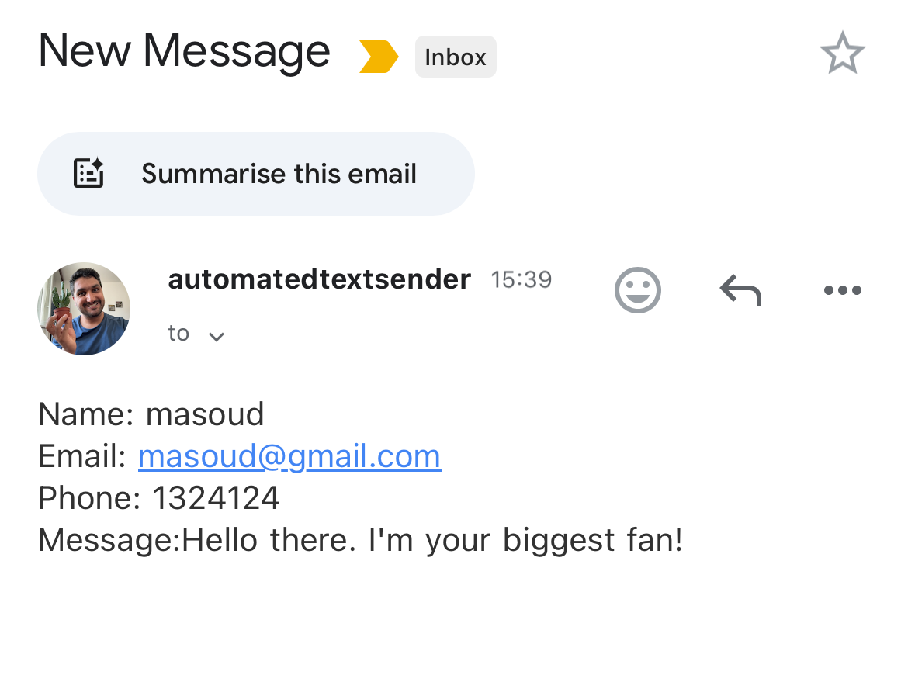

# 100 Days of Code (Python)

## Day 1/100: Band Name Generator

What I Did: Beginner - Working with Variables in Python to Manage Data.

What I Learned: Variables, Input function, Print, String Manipulation.

Link to Work: https://replit.com/@masoudmashayekh/band-name-generator-end?v=1

## Day 2/100: Tip Calculator

What I Did: Beginner - Understanding Data Types and How to Manipulate Strings.

What I Learned: Data type, Numbers, Operations, Type conversion, f-Strings.

Link to Work: https://replit.com/@masoudmashayekh/tip-calculator-start#main.py

## Day 3/100: Treasure Island

What I Did: Beginner - Control Flow and Logical Operators.

What I Learned: Conditional statements, Logical operators, Code Blocks and Scope.

Link to Work: https://replit.com/@masoudmashayekh/treasure-island-start

## Day 4/100: Treasure Island

What I Did: Beginner - Randomisation and Python Lists.

What I Learned: Randomisation and Python Lists.

Link to Work: https://replit.com/@masoudmashayekh/rock-paper-scissors-start#main.py

## Day 5/100: Create a Password Generator

What I Did: Beginner - Python Loops.

What I Learned: For Loops, Range and Code Blocks.

Link to Work: https://replit.com/@masoudmashayekh/password-generator-start#main.py

## Day 6/100: Escaping the Maze

What I Did: Beginner - Python Functions & Karel.

What I Learned: Functions, Code Blocks and while Loop.

Link to Work: https://rb.gy/e2xyt8

## Day 7/100: Hangman

What I Did: Beginner - Hangman.

What I Learned: Review, for & while Loop, if/elif, Lists, strings, range, Modules.

Link to Work: https://replit.com/@masoudmashayekh/Day-7-Hangman-5-Start#main.py

## Day 8/100: Caesar Cipher

What I Did: Beginner - Function Parameters & Caesar Cipher.

What I Learned: Function with inputs, Arguments & Parameters.

Link to Work: https://replit.com/@masoudmashayekh/caesar-cipher-4-start#main.py

## Day 9/100: The Secret Auction Program

What I Did: Beginner - Dictionaries, Nesting and the Secret Auction.

What I Learned: Dictionaries and Nesting.

Link to Work: https://replit.com/@masoudmashayekh/blind-auction-start#main.py

## Day 10/100: Calculator

What I Did: Beginner - Functions with Outputs.

What I Learned: Functions with Outputs.

Link to Work: https://replit.com/@masoudmashayekh/calculator-start#main.py

## Day 11/100: Blackjack game

What I Did: Beginner - The Blackjack Capstone Project.

What I Learned: Review, for & while Loop, if/elif, Lists, strings, range, Modules.

Link to Work: https://replit.com/@masoudmashayekh/blackjack-start#main.py

## Day 12/100: Guessing Game

What I Did: Beginner - Scope & Number Guessing Game.

What I Learned: Namespaces, Local Vs. Global scope.

Link to Work: https://replit.com/@masoudmashayekh/day-12-start#main.py

## Day 13/100: Debugging

What I Did: Beginner - Debugging.

What I Learned: Debugging.

Link to Work:

## Day 14/100: Higher Lower Game

What I Did: Beginner - Higher Lower Game Project.

What I Learned: Function, Dictionary.

Link to Work:https://replit.com/@masoudmashayekh/higher-lower-start#main.py

## Day 15/100: The Coffee Machine

What I Did: Intermediate - Local Development Environment Setup & the Coffee Machine

What I Learned: Function, Dictionary, if, while loop

Link to Work: https://rb.gy/uvz758

## Day 16/100: Object Oriented Programming (OOP)

What I Did: Intermediate - Object Oriented Programming (OOP)

What I Learned: Object Oriented Programming (OOP)

Link to Work: https://rb.gy/kzk1oh

## Day 17/100: The Quiz Project & the Benefits of OOP

What I Did: Intermediate - The Quiz Project & the Benefits of OOP

What I Learned: Object Oriented Programming (OOP), Create class

Link to Work: https://rb.gy/y29tu6

## Day 18/100: Turtle & the Graphical User Interface (GUI)

What I Did: Intermediate - Turtle & the Graphical User Interface (GUI)

What I Learned: How to use Turtle & the Graphical User Interface (GUI), TK color, basic import, Aliasing Modules, Install Modules, python tuple, use Colorgram package, review: (List, for loop, Random Module)

Link to Work: https://shorturl.at/bZLu7

## Day 19/100: Turtle Race and Etch-a-Sketch

What I Did: Intermediate - Instances, State and Higher Order Functions

What I Learned: More Turtle Graphics, Event Listeners state and Multiple Instances

Link to Work: https://shorturl.at/Myag2

## Day 20/100: Build the Snake Game Part 1

What I Did: Intermediate - Build the Snake Game Part 1: Animation & Coordinates

What I Learned: Turtle Graphics, Event Listeners state and Multiple Instances, Create class, Use screen.tracer(), screen.update(), time.sleep()

Link to Work: https://shorturl.at/PuzXP

## Day 21/100: Build the Snake Game Part 2

What I Did: Intermediate - Build the Snake Game Part 2: Inheritance & List Slicing

What I Learned: Inheritance & List Slicing

Link to Work: https://shorturl.at/oSYwv

## Day 22/100: Build Pong Game

What I Did: Intermediate - Build Pong: The Famous Arcade Game

What I Learned: Learn more how to use class and Inheritance

Link to Work: https://shorturl.at/PbsC5

## Day 23/100: The Turtle Crossing Capstone Project

What I Did: Intermediate - The Turtle Crossing Capstone Project

What I Learned: Learn more how to use class and Inheritance

Link to Work: https://shorturl.at/8DGcL

## Day 24/100: The Mail Merge Challenge

What I Did: Intermediate - Files, Directories and Paths

What I Learned: Working with Local files and Directories

Link to Work: https://shorturl.at/QROlA

## Day 25/100: U.S. States Game

What I Did: Intermediate - Working with CSV Data and the Pandas Library

What I Learned: Working with CSV Data and the Pandas Library

Link to Work: https://shorturl.at/OHwrc

## Day 26/100: NATO Alphabet

What I Did: Intermediate - List Comprehension and the NATO Alphabet

What I Learned: List Comprehension, Dictionary Comprehension, Pandas Library

Link to Work: https://shorturl.at/ZLaeI

## Day 27/100: Miles to Kilometer Converter

What I Did: Intermediate - Tkinter, \*args, \*\*kwargs and Creating GUI Programs

What I Learned: Tkinter, \*args, \*\*kwargs and Creating GUI Programs

Link to Work: https://shorturl.at/jF1XV

## Day 28/100: Pomodoro GUI Application

What I Did: Intermediate - Tkinter, Dynamic Typing and the Pomodoro GUI Application

What I Learned: Tkinter, \*args, \*\*kwargs and Creating GUI Programs

Link to Work: https: https://shorturl.at/PdCXg

## Day 29/100: Password Manager

What I Did: Intermediate - Building a Password Manager GUI App with Tkinter

What I Learned: Tkinter, Dialog Boxs and Pop_up in Tkinter, pyperclip

Link to Work: https: https://shorturl.at/AtsXZ

Useful links:https://tkdocs.com/tutorial/canvas.html

https://www.w3schools.com/python/python_file_write.asp

https://tkdocs.com/tutorial/widgets.html#entry

https://pypi.org/project/pyperclip/

https://www.w3schools.com/python/ref_string_join.asp

## Day 30/100: Improving Password Manager

What I Did: Intermediate - Errors, Exceptions and JSON Data: Improving the Password

What I Learned: Errors, Exceptions and JSON Data

Link to Work: https: https://shorturl.at/2IwDX

Useful links:

json: https://docs.python.org/3/library/json.html

## Day 31/100: Flash Card App Capstone Project

What I Did: Intermediate - Flash Card App Capstone Project

What I Learned: review

Link to Work: https://shorturl.at/4cmwD

Useful links: https://shorturl.at/lMAj5

https://shorturl.at/6sUJK

https://shorturl.at/z2cuS

https://www.w3schools.com/python/ref_list_remove.asp

https://shorturl.at/3h9aG

## Day 32/100: Automated Birthday Wisher Project

What I Did: Intermediate+ Send Email (smtplib) & Manage Dates (datetime)

What I Learned: Email SMTP and datetime module

Link to Work: https://shorturl.at/OyqZN

Useful links: https://docs.python.org/3/library/smtplib.html

https://docs.python.org/3/library/datetime.html

## Day 33/100: ISS Overhead Notifier

What I Did: Intermediate+ API Endpoints & API Parameters - ISS Overhead Notifier

What I Learned: Application Programming Interfaces(APIs) Endpoints & API Parameter, Email SMTP and datetime module, HTTP Codes

Link to Work: https://shorturl.at/5e0fL

Useful links:

https://en.wikipedia.org/wiki/International_Space_Station

https://en.wikipedia.org/wiki/API

http://open-notify.org/Open-Notify-API/ISS-Location-Now/

https://chromewebstore.google.com/detail/json-viewer/gbmdgpbipfallnflgajpaliibnhdgobh

https://www.webfx.com/web-development/glossary/http-status-codes/

https://www.latlong.net/Show-Latitude-Longitude.html

https://docs.python-requests.org/en/latest/

https://kanye.rest/

https://sunrise-sunset.org/api

https://www.w3schools.com/python/ref_string_split.asp

https://www.latlong.net/

## Day 34/100: Quiz App

What I Did: Intermediate+ API Practice - Creating a GUI Quiz App

What I Learned: Application Programming Interfaces(APIs), Unescaping HTML entities, Type hints and Arrows

Link to Work: https://shorturl.at/mOUsC

Useful links:

https://opentdb.com/

https://www.w3schools.com/html/html_entities.asp

https://stackoverflow.com/questions/2087370/decode-html-entities-in-python-string

https://www.freeformatter.com/html-escape.html

https://stackoverflow.com/questions/53580507/disable-enable-button-in-tkinter

https://www.google.com/search?q=how+to+get+tkinter+text+in+canvas+to+wrap&oq=how+to+get+tkinter+text+in+canvas+to+wrap&aqs=chrome..69i57j33.7303j0j1&sourceid=chrome&ie=UTF-8

## Day 35/100: Rain Alert

What I Did: Intermediate+ Keys, Authentication & Environment Variables: Send SMS

What I Learned: API Keys, Authentication & Environment Variables, Send SMS

Link to Work: https://shorturl.at/4BjRX

Useful links:

https://home.openweathermap.org/users/sign_up

https://openweathermap.org/current

https://www.latlong.net/

https://jsonviewer.stack.hu/

https://openweathermap.org/forecast5

https://openweathermap.org/weather-conditions#Weather-Condition-Codes-2

https://www.ventusky.com/

https://stackoverflow.com/questions/509211/how-slicing-in-python-works

https://login.twilio.com/u/signup?state=hKFo2SB3aERwVFJfSDlQX2FpNkItVVpVSk5ISVVtMDZEaHVLaqFur3VuaXZlcnNhbC1sb2dpbqN0aWTZIDlqZlRFT1hUMkVUR19ValFVZHZKNXZ6OTFSWUdlbGE4o2NpZNkgTW05M1lTTDVSclpmNzdobUlKZFI3QktZYjZPOXV1cks

https://www.twilio.com/docs/messaging/quickstart/python

https://help.pythonanywhere.com/pages/TwilioBehindTheProxy/

https://en.wikipedia.org/wiki/Environment_variable

https://apilist.fun/

## Day 36/100: Stock Trading News Alert Project

What I Did: Intermediate+ Stock Trading News Alert Project

What I Learned: API Keys, Authentication & Environment Variables, Send SMS

Link to Work: https://shorturl.at/cOTjr

Useful links:

https://www.tradingview.com/symbols/NASDAQ-TSLA/

https://www.twilio.com/en-us

https://newsapi.org/

https://www.alphavantage.co/

## Day 37/100: Habit Tracking Project

What I Did: Intermediate+ Habit Tracking Project: API Post Requests & Headers

What I Learned: API Post Requests & Headers

Link to Work: https://shorturl.at/YEkXf

Useful links:

https://www.w3schools.com/python/python_datetime.asp

https://requests.readthedocs.io/en/latest/api/

https://docs.pixe.la/

https://pixe.la/

## Day 38/100: Workout Tracking

What I Did: Intermediate+ Workout Tracking Using Google Sheets

What I Learned: API Post Requests & Headers

Link to Work: https://shorturl.at/q4jIr

Useful links:

https://www.nutritionix.com/business/api

https://docx.syndigo.com/developers

https://sheety.co/

## Day 39/100: Part 1: Flight Deal Finder

What I Did: Intermediate+ Capstone Part 1: Flight Deal Finder

What I Learned: API Post Requests & Headers, Use Class

Link to Work: https://shorturl.at/eSTDH

Useful links:

https://sheety.co/

https://lnkd.in/dWA2GWwn

https://lnkd.in/dFABESFn

https://lnkd.in/dUYuWryX

https://lnkd.in/dBKWp7jU

## Day 40/100: Part 2: Flight Deal Finder

What I Did: Intermediate+ Capstone Part 2: Flight Deal Finder

What I Learned: API Post Requests & Headers, Use Class

Link to Work: https://shorturl.at/Iqmf2

Useful links:

https://sheety.co/

https://lnkd.in/dWA2GWwn

https://lnkd.in/dFABESFn

https://lnkd.in/dUYuWryX

https://lnkd.in/dBKWp7jU

https://lnkd.in/dH3uMztN

https://lnkd.in/dX-XY5Nv

https://lnkd.in/dH3uMztN

https://lnkd.in/dX-XY5Nv

## Day 41/100: Introduction to HTML

What I Did: Web Foundation - Introduction to HTML

What I Learned: Introduction to HTML

Link to work: https://shorturl.at/Kwqc1

Useful links:

https://marketplace.visualstudio.com/items?itemName=ms-vscode.live-server

https://marketplace.visualstudio.com/items?itemName=esbenp.prettier-vscode

https://marketplace.visualstudio.com/items?itemName=vscode-icons-team.vscode-icons

https://developer.mozilla.org/en-US/docs/Web/HTML/Element/Heading_Elements

https://www.diffchecker.com/

## Day 42/100: Introduction to HTML

What I Did: Web Foundation - Introduction to HTML

What I Learned: HTML Boilerplate, List Elements, Nesting and Indentation, Anchor Elements, Image Elements

Link to work: https://shorturl.at/Igo0p

Useful links:

https://developer.mozilla.org/en-US/docs/Web/HTML

## Day 43/100: Introduction to CSS

What I Did: Web Foundation - Introduction to CSS

What I Learned: How to add CSS,CSS Selectors

Link to work: https://shorturl.at/W7AGF

## Day 44/100: Introduction to CSS

What I Did: Web Foundation - Introduction to CSS

What I Learned: CSS Color, Font properties, Inspection CSS, the CSS box Model-margin, padding and Border

Link to work: https://shorturl.at/iGhrN

Useful links:

https://chromewebstore.google.com/detail/pesticide-for-chrome/bakpbgckdnepkmkeaiomhmfcnejndkbi

https://www.csfieldguide.org.nz/en/interactives/rgb-mixer/

https://developer.mozilla.org/en-US/docs/Web/CSS/named-color

## Day 45/100: Web Scraping with Beautiful Soup

What I Did: Intermediate+ Web Scraping with Beautiful Soup

What I Learned: use Beautiful Soup,Finding and Selecting Particular Elements with BeautifulSoup, Scraping a Live Website

Link to work: https://shorturl.at/t7wRA

Useful links:

https://www.crummy.com/software/BeautifulSoup/bs4/doc/

## Day 46/100: Create a Spotify Playlist

What I Did: Intermediate+ Create a Spotify Playlist using the Musical Time Machine

What I Learned: use Beautiful Soup,Finding and Selecting Particular Elements with BeautifulSoup, Scraping a Live Website,

Link to work: https://shorturl.at/Bp2DT

Useful links:

https://spotipy.readthedocs.io/en/2.24.0/

https://developer.okta.com/blog/2017/06/21/what-the-heck-is-oauth

https://developer.spotify.com/dashboard

https://www.billboard.com/charts/hot-100/2000-08-12/

## Day 47/100: Amazon Price Tracker

What I Did: Intermediate+ Create an Automated Amazon Price Tracker

What I Learned: use Beautiful Soup,Finding and Selecting Particular Elements with BeautifulSoup, Scraping a Live Website, Email SMTP, .env file

Link to work: https://shorturl.at/5Sjlu

Useful links:

https://www.w3schools.com/python/ref_string_split.asp

https://pypi.org/project/python-dotenv/

https://myhttpheader.com/

https://stackoverflow.com/questions/6260457/using-headers-with-the-python-requests-librarys-get-method

https://it.camelcamelcamel.com/

## Day 48/100: Game Playing Bot

What I Did: Intermediate+ Selenium Webdriver Browser and Game Playing Bot

What I Learned: Selenium Webdriver Browser,Finding and Selecting Particular Elements with Selenium Webdriver Browser

Link to work: https://shorturl.at/uHj69

Useful links:

https://selenium-python.readthedocs.io/

https://www.w3schools.com/xml/xpath_intro.asp

https://www.python.org/

https://www.selenium.dev/documentation/webdriver/elements/locators/

https://www.w3schools.com/python/ref_string_split.asp

https://www.w3schools.com/python/ref_string_strip.asp

https://stackoverflow.com/questions/13293269/how-would-i-stop-a-while-loop-after-n-amount-of-time

## Day 49/100: Automating Job Applications on LinkedIn

What I Did: Intermediate+ Automating Job Applications on LinkedIn

What I Learned: Selenium Webdriver Browser,Finding and Selecting Particular Elements with Selenium Webdriver Browser

Link to work: https://shorturl.at/NwSyO

Useful links:

## Day 50/100: Auto Tinder Swiping Bot

What I Did: Intermediate+ Auto Tinder Swiping Bot

What I Learned: Selenium Webdriver Browser,Finding and Selecting Particular Elements with Selenium Webdriver Browser

Link to work: https://shorturl.at/YCj16

Useful links:

## Day 51/100: Internet Speed Twitter Complaint Bot

What I Did: Intermediate + Internet Speed Twitter Complaint Bot

What I Learned: Selenium Webdriver Browser, Finding and Selecting Particular Elements with Selenium Webdriver Browser

Link to work: https://shorturl.at/2nXw7

Useful links: https://www.speedtest.net/

## Day 52/100: Instagram Follower Bot

What I Did: Intermediate + Instagram Follower Bot

What I Learned: Selenium Webdriver Browser, Finding and Selecting Particular Elements with Selenium Webdriver Browser

Link to work: https://shorturl.at/Zjnvv

Useful links: https://www.google.com/search?q=how+to+scroll+popup+selnium+python&oq=how+to+scroll+popup+selnium+python&aqs=chrome..69i57j0.19371j0j9&sourceid=chrome&ie=UTF-8
https://stackoverflow.com/questions/38041974/selenium-scroll-inside-of-popup-div
https://developer.mozilla.org/en-US/docs/Web/API/Element/scrollTop
https://developer.mozilla.org/en-US/docs/Web/API/Element/scrollHeight

## Day 53/100: Data Entry Job Automation

What I Did: Intermediate+ Web Scraping Capstone - Data Entry Job Automation

What I Learned: Selenium Webdriver Browser, Finding and Selecting Particular Elements with Selenium Webdriver Browser, BeautifulSoup

Link to work: https://shorturl.at/a1TH0

Useful links:

https://docs.python.org/3/library/stdtypes.html#str.replace

https://docs.python.org/3/library/stdtypes.html#str.strip

## Day 54/100: Automating Job Applications on LinkedIn

What I Did: Intermediate+ Introduction to Web Development with Flask

What I Learned: Introduction to Web Development with Flask

Link to work: https://shorturl.at/0f9cp

Useful links:

https://docs.python.org/3/library/__main__.html

https://docs.python.org/3/library/stdtypes.html#special-attributes

https://github.com/appbrewery/terminal-mac-cheatsheet

https://flask.palletsprojects.com/en/stable/quickstart/

https://pypi.org/project/Flask/

## Day 55/100: Higher Lower Game

What I Did: Intermediate+ HTML & URL Parsing in Flask and the Higher Lower Game

What I Learned: Introduction to Web Development with Flask, HTML & URL Parsing in Flask

Link to work: https://shorturl.at/tRcKy

Useful links: https://flask.palletsprojects.com/en/stable/quickstart/#routing

## Day 56/100: Rendering HTML/Static files

What I Did: Intermediate+ Rendering HTML/Static files and Using Website Templates

What I Learned: Rendering HTML/Static Files and Using Website Templates

Link to work: https://shorturl.at/WHI57

Useful links: https://flask.palletsprojects.com/en/stable/quickstart/#rendering-templates

https://html5up.net/

https://angelabauer.github.io/cv/

https://flask.palletsprojects.com/en/stable/quickstart/#variable-rules

https://unsplash.com/

https://giphy.com/

## Day 57/100: Dynamic HTML pages with Jinja

What I Did: Intermediate+ Templating with Jinja in Flask Applications

What I Learned: URL Building and Templating with Jinja, I write some code in my server and send it over to template to render ex.({{year}}),

Link to work: https://shorturl.at/JD5es

Useful links:
https://jinja.palletsprojects.com/en/stable/templates/

https://flask.palletsprojects.com/en/stable/quickstart/#rendering-templates

https://agify.io/

https://flask.palletsprojects.com/en/stable/quickstart/#routing

https://www.npoint.io/docs/c790b4d5cab58020d391

https://www.npoint.io/

## Day 58/100: Startup Website for TinDog

|  |  |  |
| -------------------------------------------------------------------------------------- | -------------------------------------------------------------------------------------- | -------------------------------------------------------------------------------------- |
|  |  |  |

What I Did: Startup Website for TinDog - Web Foundation Bootstrap

What I Learned: What is Bootstrap?, Bootstrap Layout, Bootstrap Components, Project - A Startup Website for TinDog

Link to work:
[github](/Day_58_Web_Foundation_Bootstrap/11.3%20TinDog%20Project/index.html)

Useful links:

- https://getbootstrap.com/

- Ex: https://appbrewery.github.io/bootstrap-layout/

## Day 59/100: Blog Capstone Project

|  |  |  |
| ---------------------------------------------------------------------------------- | ---------------------------------------------------------------------------------- | ---------------------------------------------------------------------------------- |
|  |  |                                                                                    |

What I Did: Advanced - Blog Capstone Project Part 2 - Adding Styling

What I Learned: add new page, use API, linking all pages

Link to work:
[github](/Day_59_Advanced_Blog_Capstone/blog/)

Useful links:

- https://bootstrapmade.com/
- https://getbootstrap.com/docs/5.0/examples/
- https://www.creative-tim.com/bootstrap-themes/free
- https://flask.palletsprojects.com/en/stable/quickstart/#static-files
- https://jinja.palletsprojects.com/en/stable/templates/#include
- https://flask.palletsprojects.com/en/stable/api/#flask.Flask.url_for
- https://www.npoint.io/
- https://jinja.palletsprojects.com/en/stable/templates/#variables
- https://api.npoint.io/674f5423f73deab1e9a7
- https://www.npoint.io/docs/674f5423f73deab1e9a7
- https://jinja.palletsprojects.com/en/stable/templates/#for

## Day 60/100: Make POST Requests with Flask and HTML Forms

|  |  |  |

What I Did: Advanced - Make POST Requests with Flask and HTML Forms

What I Learned:
- Make the Contact Form Work
- HTML Forms Revision - Creating a Form from Scratch
- Handle POST Requests with Flask Servers
- Getting the Contact Form to Work
- Sending Email with smtplib

Link to work:
[github](/Day_60_Advanced_Make_POST_Requests_with_Flask_HTML_Forms/)

Useful links:
- https://www.w3schools.com/tags/att_form_method.asp
- https://www.w3schools.com/tags/att_form_action.asp
- https://flask.palletsprojects.com/en/stable/quickstart/#http-methods

## Day 61/100: Building Advanced Forms with Flask-WTForms

What I Did: Advanced - Building Advanced Forms with Flask-WTForms

What I Learned:
- Installing Flask-WTF
- Creating Forms with Flask-WTF
- Code Improvements for Our WTForms
- Adding Validation to Forms with Flask-WTF
- Receiving Form Data with WTForms
- Inheriting Templates Using Jinja2
- Using Bootstrap-Flask as an Inherited Template
- Bootstrap-Flask Supports WTForms

Link to work:
[github](./Day_61_Building_Advanced_Forms_with_Flask_WTForms/)

Useful links:
- WTForms: https://wtforms.readthedocs.io/en/3.0.x/
- Basic fields: https://wtforms.readthedocs.io/en/3.0.x/fields/#basic-fields
- Validators: https://wtforms.readthedocs.io/en/3.0.x/crash_course/#validators
- Displaying Errors: https://wtforms.readthedocs.io/en/3.0.x/crash_course/#displaying-errors
- bootstrap-flask: https://bootstrap-flask.readthedocs.io/en/stable/

## Day 62/100: 
What I Did: 

What I Learned:

Link to work:

Useful links:

## Day 63/100: 
What I Did: 

What I Learned:

Link to work:

Useful links:

## Day 64/100: 
What I Did: 

What I Learned:

Link to work:

Useful links:

## Day 65/100: How to Create a Website that People will Love
|  |  |  |

What I Did: Web Design School - How to Create a Website that People will Love

What I Learned:
- Introduction to Web Design
- Understanding Color Theory
- Understanding Typography and How to Choose
- Manage ATTENTION with effective User Interface (UI) Design
- User Experience (UX) Design
- Web Design in Practice - Let's apply what we've learnt!

Link to work:

Useful links:
- https://colorhunt.co/
- https://color.adobe.com/create/color-wheel
- https://www.dailyui.co/